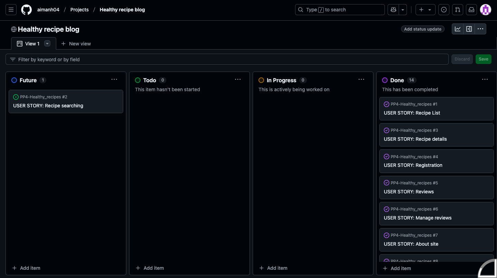
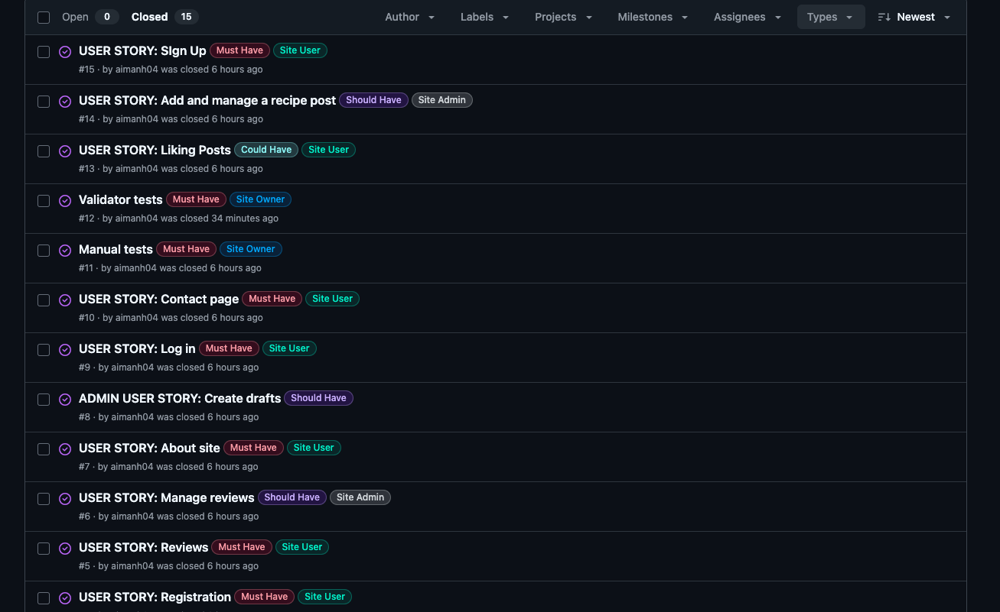

# Healthy Recipes PP4

Link to the live project: [Healthy Recipes](https://aimanh04-healthy-recipes-471caddd57c4.herokuapp.com/)

Welcome to the **Healthy Recipes**!
Healthy Recipes is a Django-powered web application designed to inspire and assist users in discovering, sharing, and managing nutritious meal ideas. Our platform offers a diverse collection of healthy recipes, each accompanied by detailed instructions, ingredient lists, and nutritional information.​

## TABLE OF CONTENTS

- [USER EXPERIENCE](#user-experience)
- [DESIGN](#design)
- [FEATURES](#features)
- [CODE TECHNOLOGIES USED](#code-technologies-used)
- [TESTING](#testing)
- [VALIDATION](#validation)
- [DEPLOYMENT](#deployment)
- [CREDITS](#credits)

## USER EXPERIENCE

#### Agile Methodology

Agile

The Healthy Recipes project followed Agile methodology, using iterative sprints to prioritize key features and improve based on user feedback. The MoSCoW method helped classify features, ensuring core functionalities like browsing, authentication, and recipe management were developed first. Continuous testing and refinements kept the platform user-friendly and responsive.

#### MoSCoW

MoSCoW

This project applied the MoSCoW prioritization technique to categorize its features and requirements based on their significance in achieving a minimum viable product (MVP). The MoSCoW method divides features into four groups: "Must have," "Should have," "Could have," and "Won't have," ensuring a structured approach to prioritization. By using this framework, the project focuses first on the most critical elements, guaranteeing that essential functionalities are addressed before less urgent ones.

#### First-Time User Goals
- Easily navigate the website and understand its purpose
- Navigate through the main menu with no problems  
- Browse available healthy recipes without needing an account  
- Browse through the website with ease and browse thorugh the existing recipes 
- Sign up for an account to save or submit recipes  

#### Returning User Goals
- Navigate the website and browse recipes effortlessly from the homepage.
- Easily add new recipes with customizable text fields for certain inputs.
- Recipe posts display like counts and a brief description directly on the homepage.
- Recipes are structured clearly for easy reading, both on the detail page and during the submission process.
- Users have full control over their own posts, with the ability to edit or delete them.
- Users can leave comments on recipes and have the option to edit or delete their own comments.
- All users can view comments left by others, ensuring engagement and interaction.

#### As an admin user
- A secure authentication process for administrators to login  
- Full CRUD functionality by adding, editing, or deleting recipes  
- Ensure the platform remains organized and up-to-date with relevant content  
- Full CRUD functionality to add, edit or delete comments on recipe posts

## DESIGN

### Color Scheme

### Database Models

#### 1. User Model
- Django's AllAuth package is used as the authentication system, managing user registration and login.
- The model includes essential fields like username, email, and password.
- A single user can create multiple recipes, establishing a one-to-many relationship between the User and Recipe models.

#### 2. Recipe Model
- The Recipe model allows users to browse various dishes, while registered users can contribute their own.
- A one-to-many relationship is maintained, as one user can submit multiple recipes.
- Users can input details such as recipe title, brief description, featured image, preparation and cooking time, serving size, list of ingredients, step-by-step directions, and any additional notes.
- Some fields, including slug (auto-generated from the title), author (linked to the logged-in user), and timestamps for creation and modification, are automatically set.
- The model supports a many-to-many relationship for likes, enabling users to express approval of recipes. These likes are displayed on both the homepage and individual recipe pages.
- Full CRUD (Create, Read, Update, Delete) capabilities are available for users managing their own recipes.

#### 3. Comment Model
- Registered users can post comments on recipes, with multiple comments being linked to a single recipe in a many-to-one relationship.
- Comments display relevant details, including the author, date, and time of submission.
- Users can create, read, edit, and delete their own comments.

#### 4. Recipe Likes Model
- This model lets users show appreciation for recipes by liking them.
- A many-to-one relationship connects multiple likes to a single recipe.
- Users have the ability to remove their likes whenever they choose.

#### 5. About Model
- This model provides visitors with background information about the platform and about myself.
- Fields include a header image, title, and descriptive content.
- Only the site administrator has permission to update this information, with full CRUD access.

#### 6. Contact Model
- This model enables communication between users and site administrators by collecting visitor details.
- Fields include name, email address and a message input for queries or feedback.
- Submitted messages are directed to the admin dashboard, where administrators can manage, update statuses, and mark them as "read."

## FEATURES

## CODE TECHNOLOGIES USED

### Languages

- Python

### Frameworks, Libraries and Programes used

- [GitHub](https://GitHub.com/) - To save and store files for the project
- [Gitpod](https://gitpod.io/) - To use as workspace to code project
- [Chrome Lighthouse](https://developers.google.com/web/tools/lighthouse) - To test the websites performance and accesibility
- [Am I Responsive](https://ui.dev/amiresponsive) - Used to test responsivness
- [PEP8 CI Python Linter](https://pep8ci.herokuapp.com/) - Used to validate my python code.
- [Heroku](https://dashboard.heroku.com/) - Used to deploy python project.
- Code Institute's Gitpod template to generate IDE workspace.

## TESTING

## VALIDATION

## DEPLOYMENT

### Steps for deployment on Heroku
1. Go to the [Heroku](https://dashboard.heroku.com/) website.
2. Click on the "Create new app" option on the dashboard.
3. Give it your project name, select your region and go on the "Create app" option.
4. Click the settings tab.
5. Go to "Reveal Config Vars" and store all your sensitive data such as creds.json & port data.
6. Set the buildbacks to Python & Nodejs in that order.
7. Click on the deploy tab.
8. Select Github as a deployment method.
9. Connect it to your Github.
10. Authorize the correct repo to connect.
11. Choose to either "Enable Automatic" or on "Deploy Branch" to deploy the project.
12. Go on "View" to see your live project.

### Forking the Github Repository
The steps to fork the github repository are:
1. Log in to your [GitHub](https://github.com/).
2. Go to the repository for !!!!.
3. Click fork on the right hand side of the screen.

### Making a local clone
To clone this repository, do the following steps:
1. Log in to your [GitHub](https://github.com/).
2. Go to the repository for this project []
().
3. Click on the code button and select whether you would like to clone with HTTPS, SSH or GitHub CLI and then copy the URL to your clipboard.
4. Open the terminal in your selected code editor and change the current working directory to the location of where you want the cloned directory.
5. Type "git clone" into the terminal, paste the link you copied and press enter.

## CREDITS

### Special Thanks To

- **Code Institute** for providing the foundational python knowledge.

- **Stack Overflow** for helpful solutions regarding python code and error handling.

- **W3Schools** for helpful solutions regarding python code and error handling.
