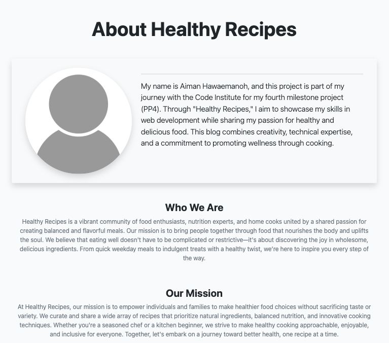

# Healthy Recipes PP4

Link to the live project: [Healthy Recipes](https://aimanh04-healthy-recipes-471caddd57c4.herokuapp.com/)

Welcome to the **Healthy Recipes**!
Healthy Recipes is a Django-powered web application designed to inspire and assist users in discovering, sharing, and managing nutritious meal ideas. Our platform offers a diverse collection of healthy recipes, each accompanied by detailed instructions, ingredient lists, and nutritional information.​

## TABLE OF CONTENTS

- [USER EXPERIENCE](#user-experience)
- [DESIGN](#design)
- [FEATURES](#features)
- [CODE TECHNOLOGIES USED](#code-technologies-used)
- [TESTING](#testing)
- [VALIDATION](#validation)
- [DEPLOYMENT](#deployment)
- [CREDITS](#credits)

## USER EXPERIENCE

#### Agile Methodology

Agile

The Healthy Recipes project followed Agile methodology, using iterative sprints to prioritize key features and improve based on user feedback. The MoSCoW method helped classify features, ensuring core functionalities like browsing, authentication, and recipe management were developed first. Continuous testing and refinements kept the platform user-friendly and responsive.

#### MoSCoW

MoSCoW

This project applied the MoSCoW prioritization technique to categorize its features and requirements based on their significance in achieving a minimum viable product (MVP). The MoSCoW method divides features into four groups: "Must have," "Should have," "Could have," and "Won't have," ensuring a structured approach to prioritization. By using this framework, the project focuses first on the most critical elements, guaranteeing that essential functionalities are addressed before less urgent ones.

#### First-Time User Goals
- Easily navigate the website and understand its purpose
- Navigate through the main menu with no problems  
- Browse available healthy recipes without needing an account  
- Browse through the website with ease and browse thorugh the existing recipes 
- Sign up for an account to save or submit recipes  

#### Returning User Goals
- Navigate the website and browse recipes effortlessly from the homepage.
- Easily add new recipes with customizable text fields for certain inputs.
- Recipe posts display like counts and a brief description directly on the homepage.
- Recipes are structured clearly for easy reading, both on the detail page and during the submission process.
- Users have full control over their own posts, with the ability to edit or delete them.
- Users can leave comments on recipes and have the option to edit or delete their own comments.
- All users can view comments left by others, ensuring engagement and interaction.

#### As an admin user
- A secure authentication process for administrators to login  
- Full CRUD functionality by adding, editing, or deleting recipes  
- Ensure the platform remains organized and up-to-date with relevant content  
- Full CRUD functionality to add, edit or delete comments on recipe posts

## DESIGN

### Color Scheme

### Database Models

#### 1. User Model
- Django's AllAuth package is used as the authentication system, managing user registration and login.
- The model includes essential fields like username, email, and password.
- A single user can create multiple recipes, establishing a one-to-many relationship between the User and Recipe models.

#### 2. Recipe Model
- The Recipe model allows users to browse various dishes, while registered users can contribute their own.
- A one-to-many relationship is maintained, as one user can submit multiple recipes.
- Users can input details such as recipe title, brief description, featured image, preparation and cooking time, serving size, list of ingredients, step-by-step directions, and any additional notes.
- Some fields, including slug (auto-generated from the title), author (linked to the logged-in user), and timestamps for creation and modification, are automatically set.
- The model supports a many-to-many relationship for likes, enabling users to express approval of recipes. These likes are displayed on both the homepage and individual recipe pages.
- Full CRUD (Create, Read, Update, Delete) capabilities are available for users managing their own recipes.

#### 3. Comment Model
- Registered users can post comments on recipes, with multiple comments being linked to a single recipe in a many-to-one relationship.
- Comments display relevant details, including the author, date, and time of submission.
- Users can create, read, edit, and delete their own comments.

#### 4. Recipe Likes Model
- This model lets users show appreciation for recipes by liking them.
- A many-to-one relationship connects multiple likes to a single recipe.
- Users have the ability to remove their likes whenever they choose.

#### 5. About Model
- This model provides visitors with background information about the platform and about myself.
- Fields include a header image, title, and descriptive content.
- Only the site administrator has permission to update this information, with full CRUD access.

#### 6. Contact Model
- This model enables communication between users and site administrators by collecting visitor details.
- Fields include name, email address and a message input for queries or feedback.
- Submitted messages are directed to the admin dashboard, where administrators can manage, update statuses, and mark them as "read."

## FEATURES

### Blog Features

 

<strong>Menu Bar</strong>

Visting User

Logged In User

- For a visiting user the menu bar consists of Home, About, Contact, 
Sign-up and Log-in pages.
- For a logged in user the menu bar consists of Home, About, Contact, 
Add Recipe and Logout pages.

 

<strong>Home Page</strong>

Hero Image Visiting User

Hero Image Logged In User

List of Recipes on Home Page

- The home page consists of a big home image, nine recipe posts and a next button
to redirect you to the next page
- All recipes will be displayed to the user starting from the newest to oldest posts
- Recipes on the main page show an image of the dish, title, auhor name, excerpt, time stamp and total likes.

 

<strong>About Page</strong>

About Page

- The About page provides visitors with an overview of the website’s purpose and features a featured image.  
- Users can read about the inspiration behind the platform and how to navigate through its functionalities.  
- The page is updated by the admin to ensure accurate and relevant information is displayed.  

 

<strong>Contact Page</strong>

Contact Page

- The Contact page allows visitors and registered users to reach out by filling in their details and message.  
- Submitted messages are sent to the admin panel, where they can be reviewed and managed.  
- Users can provide their name, email, and a message to communicate with the site administrators. 

 

<strong>Sign-Up Page</strong>

Sign-Up Page

- The Sign-Up page allows new users to create an account by providing a username, email, and password.  
- Upon successful registration, users gain access to features such as adding recipes, commenting, and liking posts. 

 

<strong>Log-In Page</strong>

Log-In Page

- The Log-In page enables registered users to securely access their accounts using their email and password.  
- Logged-in users can add, edit, and manage their recipes, leave comments, and like other posts.  

 

<strong>Logout Page</strong>

Logout Page

- The Logout page allows users to securely sign out of their account with a single click.  
- After logging out, users are redirected to the homepage or login page for easy navigation.  
- Logging out ensures user data security and prevents unauthorized access to personal account features. 

 

<strong>Add Recipe Page</strong>

Add Recipe Page

- The Add Recipe page allows logged-in users to submit their own recipes to be displayed on the website.  
- Users can fill in various fields, including the recipe title, a short excerpt, ingredients, preparation steps, cooking time, serving size, and additional notes.  
- A featured image upload option is available to showcase the dish visually.  
- The system automatically assigns the logged-in user as the author and generates a unique URL slug based on the title.  
- Once submitted, the recipe is added to the site, appearing in the recipe list from newest to oldest.  
- Users can later edit or delete their own recipes if needed.  

 

<strong>Recipe Detail Page</strong>

Recipe Detail Page

Recipe Detail Page for Recipe Author

- The Recipe Detail page displays a full view of a selected recipe, including its featured image, title, author, and posting date.  
- Users can see key details such as preparation and cooking time, serving size, ingredient list, and step-by-step instructions.  
- A like button allows logged-in users to express appreciation for the recipe, with the total number of likes displayed.  
- The page includes a comments section where users can read, post, edit, and delete comments related to the recipe.  
- Logged-in users can interact with the recipe through likes and comments, while visitors can only view the content.  
- A back button or navigation options help users return to the main recipe list or explore more recipes.  

 

<strong>Comment Section</strong>

Comment Section

- The Comment Section allows logged-in users to post, edit, and delete their comments on recipes.  
- Each comment displays the username, timestamp, and message, appearing in chronological order.  
- Visitors can read comments, but only registered users can interact by adding or managing their own. 

 

<strong>Delete Modals</strong>

Delete Modal for comment

Delete Page for recipe

- A Delete Modal appears for confirmation about deleting a comment
- A Delete Page appears for confirmation about wanting to delete a recipe post

 

<strong>Footer</strong>

Footer

- The Footer provides quick navigation links, social media icons

## CODE TECHNOLOGIES USED

### Languages

- Python
- HTML
- JavaScript
- CSS

### Databases

- PostgreSQL from Code Institute was used as the PostgreSQL database for this project.

### Frameworks, Libraries and Programes used

- [GitHub](https://GitHub.com/) - To save and store files for the project
- [Gitpod](https://gitpod.io/) - To use as workspace to code project
- [VSCode](https://code.visualstudio.com) - Used as workspace for my project
- [Am I Responsive](https://ui.dev/amiresponsive) - Used to test responsivness
- [PEP8 CI Python Linter](https://pep8ci.herokuapp.com/) - Used to validate my python code.
- [Heroku](https://dashboard.heroku.com/) - Used to deploy project.
- [Chrome Devtools](https://developer.chrome.com/docs/devtools) - Used throughout the process to find bugs and test responsiveness on website
- [JSHint](https://jshint.com/) - To validate JavaScript code
- [W3C Markup Validation](https://validator.w3.org/) - To validate HTML code
- [W3C CSS Validation](https://jigsaw.w3.org/css-validator/) - To validate CSS code
- [Pexels](https://www.pexels.com/) - For Hero image
- [Bootstrap](https://getbootstrap.com) - Used to style website and add better responsiveness and interactivity

### Installed Django Packages  

- **Gunicorn**: Used as the web server for deployment on Heroku.  
- **Cloudinary**: Hosts static and media files for efficient content delivery.  
- **dj-database-url**: Parses the database URL from Heroku's environment variables.  
- **psycopg2-binary**: Acts as a PostgreSQL adapter for Python to manage database connections.  
- **Django Summernote**: Provides a rich-text editor for the admin panel.  
- **Django Allauth**: Handles authentication, user registration, and account management.  
- **Crispy Forms**: Enhances form styling for a better user interface.  

## TESTING

## VALIDATION

## DEPLOYMENT

### Steps for deployment on Heroku
1. Go to the [Heroku](https://dashboard.heroku.com/) website.
2. Click on the "Create new app" option on the dashboard.
3. Give it your project name, select your region and go on the "Create app" option.
4. Click the settings tab.
5. Go to "Reveal Config Vars" and store all your sensitive data such as creds.json & port data.
6. Set the buildbacks to Python & Nodejs in that order.
7. Click on the deploy tab.
8. Select Github as a deployment method.
9. Connect it to your Github.
10. Authorize the correct repo to connect.
11. Choose to either "Enable Automatic" or on "Deploy Branch" to deploy the project.
12. Go on "View" to see your live project.

### Cloudinary

1. Log in to your **Cloudinary** account.  
2. Navigate to the **Dashboard** and locate your **API Environment Variable**.  
3. Copy the API value, but **remove** `CLOUDINARY_URL=` before adding it to your **Config Vars** in the environment settings.  

### Forking the Github Repository
The steps to fork the github repository are:
1. Log in to your [GitHub](https://github.com/).
2. Go to the repository for your project.
3. Click fork on the right hand side of the screen.

### Making a local clone
To clone this repository, do the following steps:
1. Log in to your [GitHub](https://github.com/).
2. Go to the repository for this project []
().
3. Click on the code button and select whether you would like to clone with HTTPS, SSH or GitHub CLI and then copy the URL to your clipboard.
4. Open the terminal in your selected code editor and change the current working directory to the location of where you want the cloned directory.
5. Type "git clone" into the terminal, paste the link you copied and press enter.

## CREDITS

### Imagery

- [Green Detox Smoothie](https://nourishingmeals.com/recipes/green-detox-smoothie)
- [Almond Butter Baked Oatmeal](https://sweetsavoryandsteph.com/almond-butter-baked-oatmeal/)
- [Turkey & Quinoa Stuffed Peppers](https://www.food.com/recipe/healthy-quinoa-and-ground-turkey-stuffed-peppers-449167)
- [Protein-Packed Chickpea Salad](https://eatwithclarity.com/mediterranean-chickpea-salad/)
- [Lentil & Sweet Potato Curry](https://wholefoodsoulfoodkitchen.com/sweet-potato-lentil-curry/)
- [Zucchini & Tomato Gratin](https://www.allrecipes.com/recipe/215420/zucchini-e-pomodori-gratinati-zucchini-and-tomato-gratin/)
- [Sweet Potato & Kale Frittata](https://www.tastingtable.com/1427904/sweet-potato-and-crispy-kale-frittata-recipe/)
- [Baked Lemon Herb Chicken with Asparagu](https://cafedelites.com/one-pan-honey-lemon-chicken-asparagus/)
- [Cauliflower Fried Rice](https://www.onceuponachef.com/recipes/cauliflower-fried-rice.html)
- [Sweet Potato & Black Bean Tacos](https://www.simplyrecipes.com/recipes/sweet_potato_and_black_bean_tacos/)
- [Quinoa & Roasted Vegetable Salad](https://www.katysfoodfinds.com/roasted-vegetable-salad-with-quinoa-and-feta/)
- [Zucchini Noodles with Pesto](https://www.eatingwell.com/recipe/266239/zucchini-noodles-with-pesto-chicken/)
- [Grilled Salmon with Avocado Salsa](https://ketokarma.com/grilled-salmon-with-avocado-salsa-ready-in-20-minutes/)
- [Chickpea and Spinach Stew](https://www.eatingwell.com/recipe/270568/hearty-chickpea-spinach-stew/)

### Special Thanks To

- **I Think Therefore I Blog** This walkthrough was heavily relied upon my project due to time constraint and was extremily helpful. However, I did remake the design and made it my own.

- **Dee Mac Youtube Django Recipe Tutorial** [Django Recipe Tutorial](https://www.youtube.com/watch?v=sBjbty691eI&list=PLXuTq6OsqZjbCSfiLNb2f1FOs8viArjWy&index=1&ab_channel=DeeMc)

- **Dev.to** [Django Recipe App Tutorial](https://dev.to/domvacchiano/create-a-recipe-app-in-django-tutorial-5hh)

- **Medium.com** [Django Recipe CRUD Tutorial](https://medium.com/@devsumitg/recipe-crud-project-using-the-django-framework-bootstrap-5-3160ec5b43aa)

- **Code Institute** for providing the foundational python knowledge.

- **Stack Overflow** for helpful solutions regarding python code and error handling.

- **W3Schools** for helpful solutions regarding python code and error handling.

- **Slack Community** for guidance and help

- Special thanks to all the tutors who has helped me in this project with troubleshooting assistance

### Other students projects

I took inspiration from other students who made a similar project to mine

* Healthy Food Recipes 
[Healthy Food Recipes | (https://healthy-food-c44b0f8f09a5.herokuapp.com/)](https://healthy-food-c44b0f8f09a5.herokuapp.com/ "Healthy Food Recipes | (https://healthy-food-c44b0f8f09a5.herokuapp.com/)")

* TasteSENsation    
[TasteSENsation | Recipe Cookbook (tastesensation-pp4-54d01fbc1628.herokuapp.com)](https://tastesensation-pp4-54d01fbc1628.herokuapp.com/?page=2&rating=None "TasteSENsation | Recipe Cookbook (tastesensation-pp4-54d01fbc1628.herokuapp.com)")

* NicoleJackson89 / pp4-recipe-share    
[NicoleJackson89 / pp4-recipe-share https://recipe-share-58fcaea24fd7.herokuapp.com/](https://github.com/NicoleJackson89/pp4-recipe-share "NicoleJackson89 / pp4-recipe-share https://recipe-share-58fcaea24fd7.herokuapp.com/")

* Little Rascal Recipes Blog    
[https://little-rascal-recipes-7007a778b4a8.herokuapp.com/ DeveloperDunne/Little-Rascal-Recipes (github.com)](https://little-rascal-recipes-7007a778b4a8.herokuapp.com/ "https://little-rascal-recipes-7007a778b4a8.herokuapp.com/ DeveloperDunne/Little-Rascal-Recipes (github.com)")